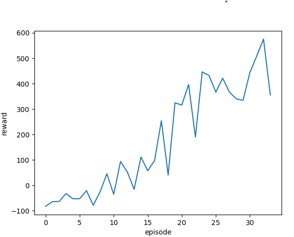

# Simple-Agents
tutorial projects that gives examples of implementing reinforcement learning algorithms
## Prepare environment:
Before running the script, several packages are needed to be installed, use the following command
```shell
pip install torch
pip install gymnasium
pip install ale_py
```
## Run the script
modify main.py to run different agent in different gym environment, for example, to create a agent and train it with double Q learning in CarRacing environment, you may write:
```python
agent1 = QAgent.VideoQAgent(video_dim=(96, 96, 3), action_num=5, device=device)

environment_name = "CarRacing-v2"
```
For complex environment like Car Racing, more modifcation may needed, for example, you may increase the experience memory size to 10000+ to ensure it is able to learn. After several episodes, you should see the reward per episode surge like this figure indicates:

